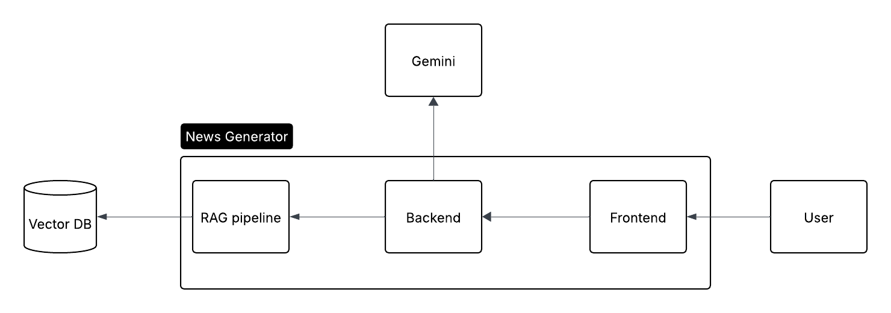

# AI-News-Generator

This project uses a RAG powered AI news generator

## Installation - submission

1. git clone
2. cd new-generated
3. npm install
4. there should be a seperate file for API keys
5. cp that into ".env"
6. npm run dev
